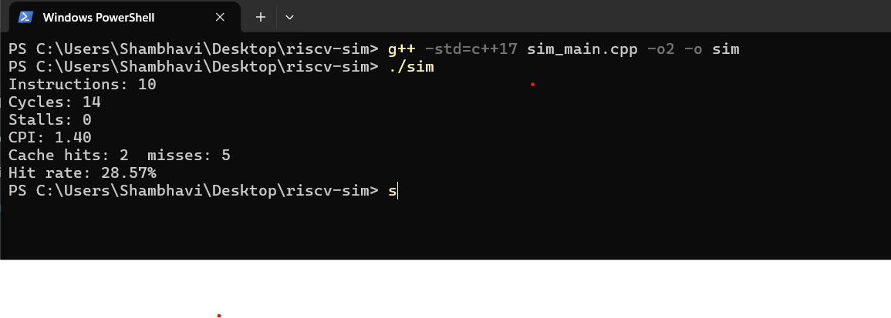

# RISC-V Pipeline + Cache Simulator

**Mini cycle-accurate CPU simulator in C++ demonstrating pipeline execution, cache behavior, and performance metrics.**  
Showcases how memory access patterns affect CPI, cache hit/miss rates, and pipeline efficiency — directly relevant to embedded systems and VLSI software engineering.

## Why This Project Matters

- Models a **5-stage instruction pipeline** (IF, ID, EX, MEM, WB) with cache simulation.
- Calculates **CPI, stalls, cache hits/misses**, providing real insight into CPU performance.
- Demonstrates **software-level modeling of hardware**, bridging CSE algorithms and VLSI/embedded design.
- Easily extensible for:
  - Branch prediction and misprediction penalties
  - Different cache sizes, associativities, replacement policies
  - Large trace files for performance testing
- Perfect example to discuss **memory optimization, performance bottlenecks, and low-level system design** in interviews.

## Build & Run


Open terminal in project folder.

Compile & Run:
```bash
g++ -std=c++17 sim_main.cpp -O2 -o sim
./sim.exe   # Windows
./sim        # Linux/Mac


Example output:
```text
Instructions: 10
Cycles: 14
Stalls: 0
CPI: 1.40
Cache hits: 2  misses: 5
Hit rate: 28.57%


```markdown

